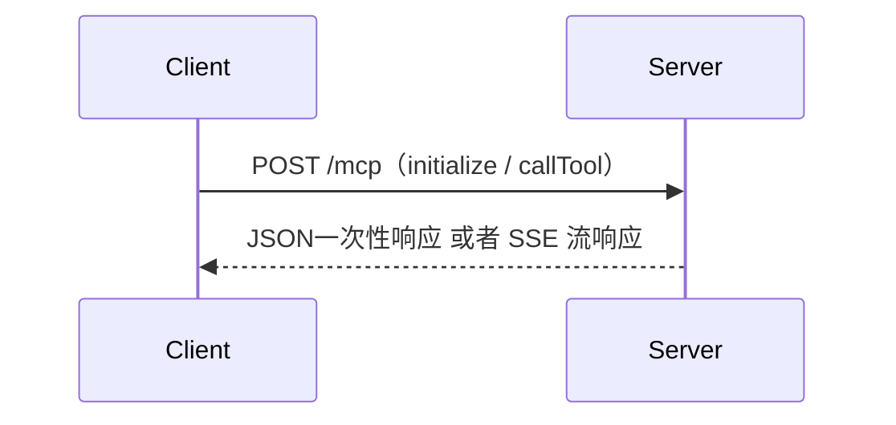
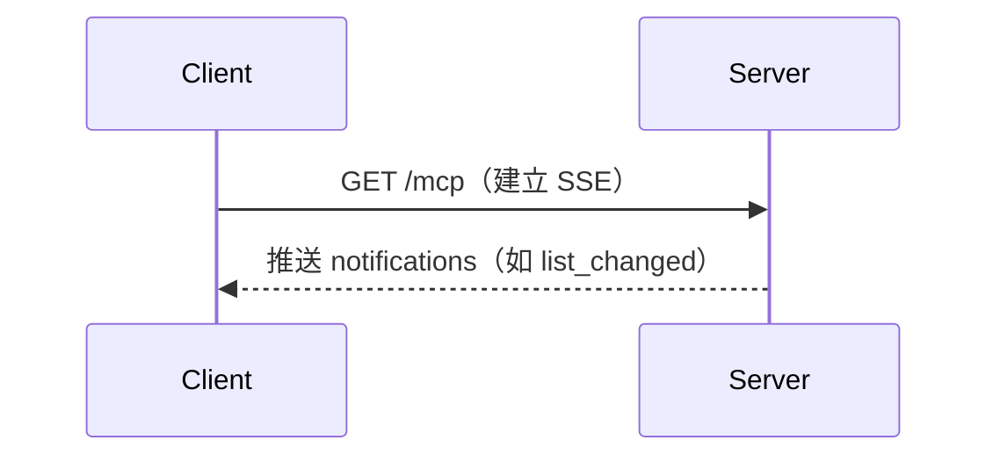

通信方式：

1. Stdio： 推荐，高效、简洁、本地
2. Streamable HTTP： 远程

## 前置知识

SSE 全称 Server-Sent Events，中文是“服务器发送事件”。是一种**基于 HTTP** 的单向通信协议，由浏览器**发起连接**，服务器可以**持续不断地向客户端推送数据**。

你可以把它想象成：“浏览器打开一个通道，然后服务器不断地往里面发消息。”

**SSE 特点**

1. 协议：基于 HTTP（长连接）
2. 方向：单向：服务器 -> 客户端
3. 格式：文本流，内容类型为 `text/event-stream`
4. 浏览器支持：所有现代浏览器都支持（IE 除外）
5. 应用场景：单方面需要推送的时候。实时通知、消息流、状态更新、股票/天气数据等

**消息格式**

SSE 协议规定，服务器以 `text/event-stream` 格式不断推送消息，每条消息格式如下：

```
event: 事件名   # 可选，默认是 message 事件
id: 唯一ID     # 可选
retry: 3000   # 客户端断线重连间隔，单位毫秒，可选
data: 内容     # 必需，可以多行
```

每条消息用空行 `\n\n` 作为结尾。

**事件类型**

如果服务器发送的数据中没有指定事件类型，浏览器端会将其作为默认事件类型 `message` 来处理：

```js
data: 这是默认消息（data 代表要发送的消息）
```

客户端监听方式：

```js
eventSource.addEventListener('message', (e) => {
  console.log('默认事件：', e.data)
})
```

可以自定义事件名：使用 `event:` 字段

```
event: update（事件名）
data: 新的更新内容
```

客户端监听方式：

```js
eventSource.addEventListener('update', (e) => {
  console.log('收到 update 事件：', e.data)
})
```

**课堂练习**

SSE 服务器推送信息示例

## StreamableHTTP

Streamable HTTP 是 MCP 中 **用于 Web 环境** 的通信方式。

客户端基于 HTTP **POST** 发送 JSON-RPC 请求，例如：

- `initialize`
- `callTool`
- `listResources`



服务端可返回：

- 普通 JSON 响应（application/json）
- 流式 SSE 响应（text/event-stream）

另外，客户端还可以和服务端建立 **持久 SSE 连接**，用于监听以下事件：

- `notifications/resources/list_changed`
- `notifications/tools/list_changed`



StreamableHTTP 使用场景

1. 通过 HTTP 接收 **远程** 请求（如前端网页、API 网关）
2. 需要支持 **多客户端** 并发访问
3. 浏览器与 MCP Server 通信
4. 流式响应（如 SSE 推送）需求

## 官方接口

在官方 SDK 里面，提供了相应的接口：StreamableHTTPServerTransport

使用方式：

```js
import { StreamableHTTPServerTransport } from '@modelcontextprotocol/sdk/server/streamableHttp.js'
import { randomUUID } from 'crypto'

const transport = new StreamableHTTPServerTransport({
  sessionIdGenerator: () => randomUUID(), // 为每个连接生成唯一会话ID
})
```

该接口内部提供了一系列的方法，其中需要了解的，是 handleRequest 方法。

```js
handleRequest(
  req: IncomingMessage,
  res: ServerResponse,
  parsedBody: unknown // 解析后的请求体
): Promise<void>;
```

内部处理流程：

1. 解析 body，识别 JSON-RPC 方法（如 "initialize", "callTool"）
2. 将请求路由给 MCP Server 的对应处理函数
3. 根据返回结果的 Content-Type 自动来决定是普通 JSON 响应还是流式响应

---

-EOF-
