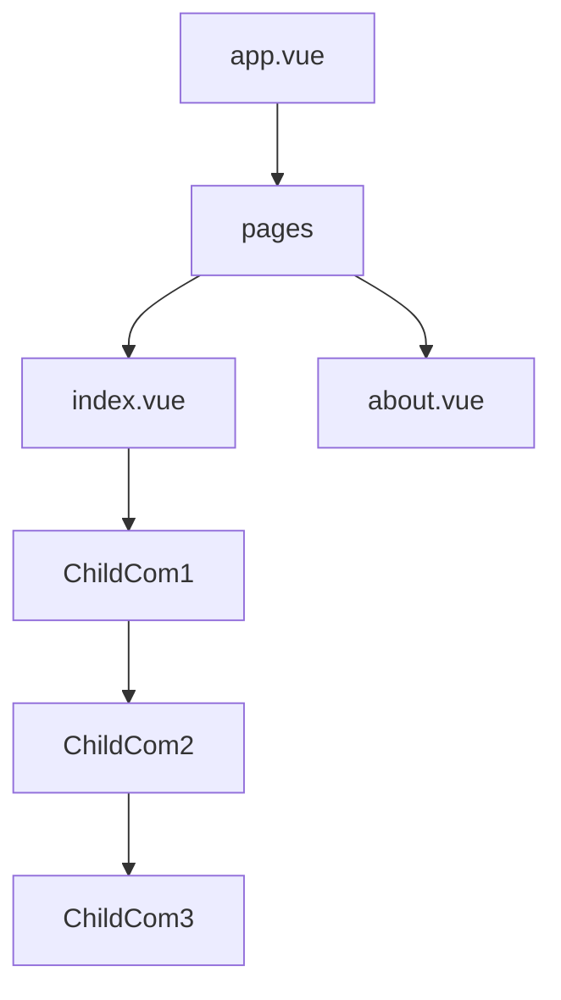

**自定义错误页**

在**项目根目录**下创建一个 error.vue 的错误组件即可（和 app.vue 平级）

在自定义错误页里面，error 对象会以 props 的形式传入。

```vue
<template>
  <p>出错啦～～～</p>
  <p>{{ error.statusCode }}</p>
  <p>{{ error.message }}</p>
</template>

<script setup>
const props = defineProps({
  error: Object,
})
console.log(props.error)
</script>
```

**相关工具方法**

- createError
- showError
- clearError

**createError**

以前用得更多的是：

```js
throw new Error()
```

通过该方法，可以在创建错误时附加额外的 [错误信息](https://nuxt.com/docs/api/utils/create-error#parameters)。

- 字符串：它将用作 error message，statusCode 默认为 500
- 对象：可以设置错误的多个属性，例如 statusCode、message 和其他错误属性

使用 createError 创建错误时，无论是在客户端还是服务端，**错误对象结构都是一致的**，Nuxt 会识别这些错误，以**预期的方式**处理。

- 服务器端：预期的处理方式就是触发全屏错误页
- 客户端：会看这个错误是否是一个致命错误
  - fatal 是 true 表明这是一个致命错误，触发全屏错误页
  - fatal 是 false 非致命，将错误显示在控制台，不会自动跳转到全屏错误页

示例：

```vue
<template>
  <div class="container">
    <h1>首页标题</h1>
    <button @click="triggerError">手动触发错误</button>
  </div>
</template>

<script setup>
const triggerError = () => {
  throw createError({
    statusCode: 404,
    message: '这是一个错误测试',
    fatal: true, // 表明这是一个致命错误
  })
}
</script>
```

**showError**

**直接跳转**到错误页。该方法接收的参数和 createError 一样的。

思考🤔：同样都是显示错误，和前面的 createError 有什么区别呢？

区别在于 createError 是创建一个错误对象，然后是通过 throw 抛出，这种方式会将错误对象向上冒泡，这意味我们可以对错误对象进行捕获然后进行处理。

```js
const triggerError = () => {
  try {
    throw createError({
      statusCode: 404,
      message: '这是一个错误测试',
      fatal: true, // 表明这是一个致命错误
    })
  } catch (e) {
    // 捕获到错误
    console.log(e, '捕获到错误了，已经处理了～')
  }
}
```

showError就非常简单暴力，直接跳转到错误页

**clearError**

顾名思义，就是清除所有的错误，有两种用法：

```ts
// Without redirect
clearError()

// With redirect
clearError({ redirect: '/homepage' })
```

**相关内置组件**

NuxtErrorBoundary：这是一个处理**错误边界**的组件，将可能出错的组件放置于错误边界组件内，即便出现错误，错误组件上面的组件也不会受错误影响，能够正常渲染出来。

当前组件树结构如下：



ChildCom3有错误的话，会导致整个首页都崩溃，渲染不出来。这个时候可以使用错误边界组件，包裹可能出错的组件，从而不影响组件树上面的组件。

**相关组合式函数**

useError：返回一个响应式引用，该引用指向当前被 Nuxt 错误处理机制捕获的错误对象。

思考🤔：useError 和 createError 有什么样的区别？

- createError：创建一个错误对象
- useError：获取当前的错误对象，在非错误页非常有用。

在Nuxt中提供了很多和错误处理相关的工具：

- 自定义全局错误页
- 工具函数
  - createError
  - showError
  - clearError
- 内置组件：NuxtErrorBoundary
- 组合式函数：useError

---

-EOF-
